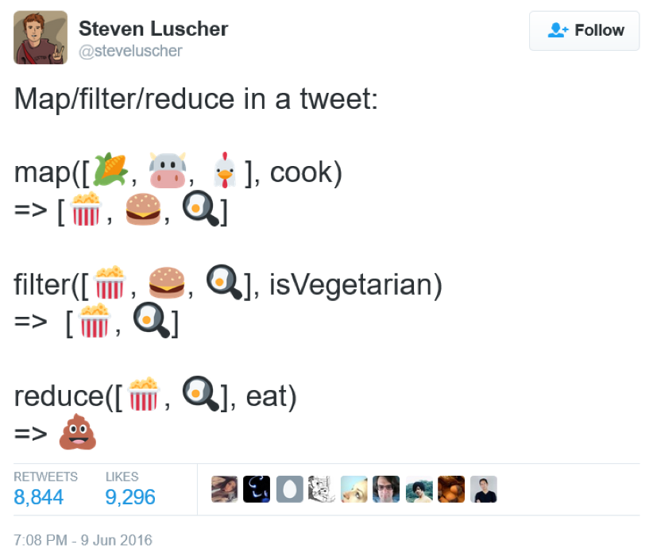

---?image=template/bg/title1.png
@title[0 - Welcome]

# A Primer on Functional Programming

Sarah Withee
@geekygirlsarah

Slides:  geekygirlsarah.com/primer-fp

---?image=template/bg/design-b.png
@title[0 - Welcome]

## Who has heard of functional programming?

---?image=template/bg/design-b.png
@title[0 - Welcome]

## Who has done some form of functional programming?

---?image=template/bg/design-b.png
@title[0 - Welcome]

## Who IS a functional prgrammer?

---?image=template/bg/design-b.png
@title[0 - Welcome]

## Who has wanted to learn but never had time or good resources?

---?image=template/bg/design-tl-br.png
@title[0 - Welcome]

## Intro

1. Functional Programming Concepts
1. Why Use Functional Programming?
1. Brief Glance at Functional Programming Languages

---?image=template/bg/design-r.png
@title[0 - Sarah]

# Hello!

@img[clip-img](img/sarahwprofile600x600.jpg)

*I am Sarah Withee*

I am a software engineer at Arcadia.io
I'm on social media as @geekygirlsarah

(Yes, you can tweet all the things)

---?image=template/bg/title1.png
@title[1 - Functional Programming Concepts]

# 1. Functional Programming Concepts

---?image=template/bg/design-tl-br.png
@title[1 - Functional Programming Concepts]

### Background

It's not new!

(Languages and ideas have been around since 1950s)

---?image=template/bg/design-tl-br.png
@title[1 - Functional Programming Concepts]

### Background

Built on ideas of lambda calculus developed in the 1930s

(I promise, we're not discussing this today)

---?image=template/bg/design-b.png
@title[1 - Functional Programming Concepts]

# Pure Functions

Function that, given a certain input, _*always*_ produces the same output.

---?image=template/bg/design-tl-br.png

### Functional Programming Concepts

Pure functions don't have side effects

---?image=template/bg/design-tl-br.png

### Functional Programming Concepts

Side effects include:
- Time
- File access
- Database access
- Network access
- Previous function calls

---?image=template/bg/design-tl-br.png

### Functional Programming Concepts

User input is never pure.

(duh)

---?image=template/bg/design-tl-br.png

### Functional Programming Concepts

Call by reference is never pure

---?image=template/bg/design-tl-br.png

### Functional Programming Concepts

Basically inpossible to write software using 100% pure functions

---?image=template/bg/design-tl-br.png

### Functional Programming Concepts

`sin(x)`

`abs(x)`

`sqrt(x)`

These always returns same values for x

---?image=template/bg/design-tl-br.png

### Functional Programming Concepts

`str.length()`

`str.isEmpty()`

`str.concat(str)`

Always returns same values for the string `str` (and `str2`)

---?image=template/bg/design-tl-br.png

### Functional Programming Concepts

`getAccountNumberFromDB(acctOwner)`

Kidding...  definitely not pure

---?image=template/bg/design-tl-br.png

### Review - Pure Functions

- Pure functions, given certain input, always produce same output
- No side effects
- User input is never pure
- Call by reference is never pure
- Impossible to write software in 100% pure functions

---?image=template/bg/design-b.png
@title[1 - ]

# Referential Transparency

Any expression that can replace a function with its return value with no behavior changes

---?image=template/bg/design-tl-br.png

### Functional Programming Concepts

Example:
If x = 3...

&nbsp;&nbsp;&nbsp;&nbsp;&nbsp;&nbsp;x + 5 = 8

&nbsp;&nbsp;&nbsp;&nbsp;&nbsp;&nbsp;3 + 5 = 8

---?image=template/bg/design-tl-br.png

### Functional Programming Concepts

(note: sin 30° = 0.5 and cos 60° = 0.5)

`x = 30`

`y = sin(x) + cos(x * 2)       # y = 1`

`y = sin(30) + cos (30 * 2)`

`y =    0.5  +   0.5           # y - 1`

---?image=template/bg/design-tl-br.png

### Functional Programming Concepts

Pure functions _always_ have referential transparency

---?image=template/bg/design-tl-br.png

### Functional Programming Concepts

In mathematics, all functions are transparent.

In programming, this is NOT true.

---?image=template/bg/design-tl-br.png

### Functional Programming Concepts

Assignments are NOT transparent

`x = x + 1`

---?image=template/bg/design-tl-br.png

### Functional Programming Concepts

Referencially transparent assignment:

```
def addOne (int num):
   return num + 1; 

y = addOne(x)
```

---?image=template/bg/design-tl-br.png

### Functional Programming Concepts

More languages are starting to have immutable variables by default

---?image=template/bg/design-tl-br.png

### Functional Programming Concepts

Lambda function (or anonymous function):

A function without a name

---?image=template/bg/design-tl-br.png

### Functional Programming Concepts

Why lambdas?

- For building up higher-level functions
- To pass arguments to another function
- Used once to a few times

---?image=template/bg/design-tl-br.png

### Functional Programming Concepts

Lambda's can't be recursive*

`*` otherwise they need a name or some way to maintain state

`**` which is possible but outside of the scope of this talk

---?image=template/bg/design-tl-br.png

### Functional Programming Concepts

[lambda example here]

```
f = lambda x: x * x
print f(5)
```

```
> 25
```

---?image=template/bg/design-tl-br.png

### Functional Programming Concepts

Functions ARE values

Can be passed into other functions

---?image=template/bg/design-b.png

```
define divide(x, y):
    return x / y

def divisor(d):
    return lambda r: divide (r, d)

half = divisor(2)

print(half(32))
```

---?image=template/bg/design-tl-br.png

### Functional Programming Concepts

Who has heard of map/filter/reduce?

---?image=template/bg/design-tl-br.png

### Functional Programming Concepts

Who has _used_ map/filter/reduce?

---?image=template/bg/design-tl-br.png

### Functional Programming Concepts

map - apply a function to all terms in a list

usage:

`map (function, list)`

---?image=template/bg/design-b.png

### Functional Programming Concepts

```
items = [1, 2, 3, 4, 5]

squared = map (lambda x: x ** 2, items)

# same as:
squared = []
for i in items:
    squared.append (i ** 2)
```

---?image=template/bg/design-tl-br.png

### Functional Programming Concepts

filter - creates a list of all items matching a filter (a function that returns true)

usage:

`filter (function, list)`

---?image=template/bg/design-b.png

### Functional Programming Concepts

```
items = [1, 2, 3, 4, 5, 6, 7, 8]

under_5 = filter (lambda x: x < 5, items)

# same as:
under_5 = []
for i in items:
    if (i < 5):
        under_5.append(i)
```

---?image=template/bg/design-tl-br.png

### Functional Programming Concepts

reduce - returns result of some computation on a list

usage:

`reduce (function, list)`

---?image=template/bg/design-b.png

### Functional Programming Concepts

```
items = [1, 2, 3, 4, 5, 6, 7, 8]

product = reduce (lambda x, y: x * y, items)

# same as:
product = 1
for i in items:
    product = product * num
```

---?image=template/bg/design-tl-br.png

### Functional Programming Concepts

 Note: reduce works differently in different languages

Examples:

`reduce_left()`

`reduce_right()`

---?image=template/bg/design-b.png

### Functional Programming Concepts



Source: https://twitter.com/steveluscher/status/741089564329054208


---?image=template/bg/title1.png
@title[2 - Why Use Functional Programming?]

# 2. Why Use Functional Programming?

---?image=template/bg/design-tl-br.png

### Why Use Functional Programming?

Pure functions are simpler and faster to write

---?image=template/bg/design-tl-br.png

### Why Use Functional Programming?

Pure functions that work correctly will _*always*_ work correctly

---?image=template/bg/design-tl-br.png

### Why Use Functional Programming?

Stack traces are a pain in OOP

Stack traces in FP simplify things

---?image=template/bg/design-tl-br.png

### Why Use Functional Programming?

Unit testing IS* functional programming. No side effects make unit tests pass reliably.

`*` Well, should be anyway...

---?image=template/bg/design-tl-br.png

### Why Use Functional Programming?

Global state of program isn't affected by pure functions

---?image=template/bg/design-tl-br.png

### Why Use Functional Programming?

Concurrency is WAY easier

---?image=template/bg/design-tl-br.png

### Why Use Functional Programming?

As code grows larger, it's all more reliable

_Better small modules -> better large modules_

---?image=template/bg/design-b.png

**Activity 1**

In a moment, everyone will stand up.

1. Start at the beginning of the room with 0
1. Each person will take the previous number, add 1 to it
1. Say the number out loud
1. Sit down
1. Last person reports the total

---?image=template/bg/design-b.png

**Activity 2**

In a moment, everyone will stand up.

1. You are 1 person, so your number is 1
1. Find a neighbor
1. Total your two numbers together
1. One of you sits down
1. Repeats steps 2-4 for each person
1. Each volunteer for will count the array of results (end of each row), add them up
1. Volunteer will return the final result

